# Deep Learning Framework for Concrete Crack Detection

This project presents a robust and scalable Deep Learning framework to detect and classify cracks in concrete structures. Identifying structural damage early is critical for civil engineering and maintenance. The pipeline extracts critical visual features from images and trains several robust Convolutional Neural Networks (CNNs) entirely within a Google Colab environment, leveraging Google Drive for data storage and output persistence and NVMe storage for fast data processing.

## 📝 Datasets
The project evaluates the models across two distinct, publicly available datasets to ensure robust generalization:
- **Dataset 1:** [Concrete Crack Images for Classification (Mendeley Data)](https://data.mendeley.com/datasets/5y9wdsg2zt/2)
  - Contains precisely cropped regions of positive (cracked) and negative (non-cracked) concrete surfaces. Extremely high scale (40,000 images).
- **Dataset 2:** [Crack Detection Dataset (GitHub - tjdxxhy)](https://github.com/tjdxxhy/crack-detection)
  - Contains labeled pictures of concrete structures spanning diverse resolutions and cracking severity (split securely via train/val files).

## 🛠️ Technologies & Libraries Used
- **Environment:** Google Colab (GPU mode - T4) optimized with Mixed-Precision training.
- **Storage:** Google Drive (Mounted for input data & output export)
- **Language:** Python
- **Deep Learning:** `TensorFlow 2.x`, `Keras`
- **Machine Learning:** `scikit-learn`
- **Data Manipulation:** `NumPy`, `Pandas`
- **Visualization:** `Matplotlib`, `Seaborn`

---

### 1. Model Architectures
To evaluate the impact of network depth, transfer learning, and architectural choices, three models were constructed:
- **Basic CNN:** An explicitly lightweight architecture with alternating 2D Convolutions, Batch Normalization (to prevent vanishing gradients), and Max Pooling layers. Fast to train, establishing a high baseline.
- **Zhang CNN:** An adaptation of the specialized network architecture proposed by Zhang et al., designed specifically to localize sparse structural features (like tiny fractures) using aggressive stride reductions early in the network.
- **VGG16 Fine-Tuned:** Utilizing Transfer Learning, the top layers of pre-trained VGG16 (ImageNet weights) are unfrozen. A GlobalAveragePooling2D layer prevents overfitting, acting as a deep feature extractor for challenging samples.

### 2. Preprocessing & ML Pipeline
- **Optimizations:** Mixed Precision (`mixed_float16`) enables up to 3x performance speedups on Colab T4 GPUs, safely fitting batches of high-res images in VRAM.
- **Data Loading:** Leveraging `tf.data.AUTOTUNE`, images are extracted directly to Colab's local NVMe SSDs and asynchronously streamed to the GPU.
- **Data Splits:** 80% Train / 20% Validation Split automatically maintained per dataset.

---

## 📊 Results & Comparative Analysis

The models were benchmarked fiercely, tracking Accuracy, Precision, Recall, and F1-Score to ensure class-balance stability. 

### Dataset 1 Evaluation
| Model | Accuracy | Precision | Recall | F1-Score |
|---|---|---|---|---|
| **VGG16 Fine-Tuned** | **99.95%** | 99.92% | **99.97%** | **99.94%** |
| **Zhang CNN** | 99.92% | **99.97%** | 99.87% | 99.92% |
| **Basic CNN** | 99.22% | 99.07% | 99.37% | 99.22% |

  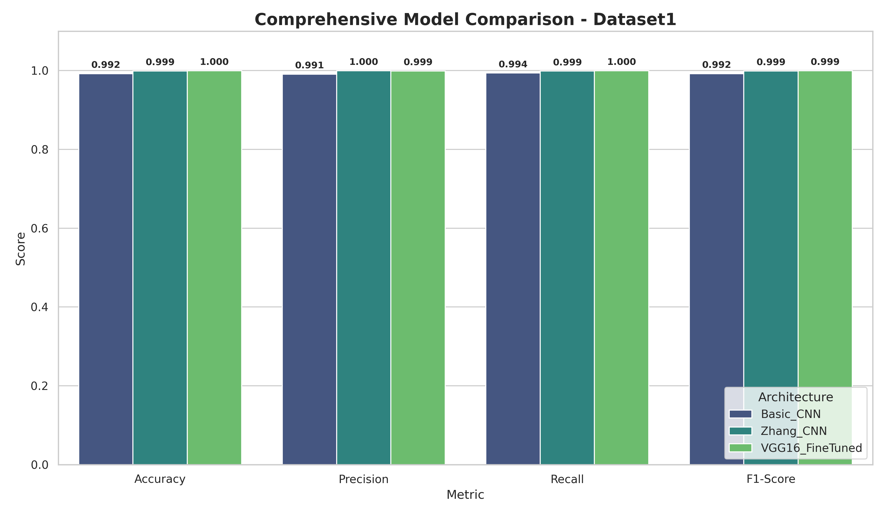
  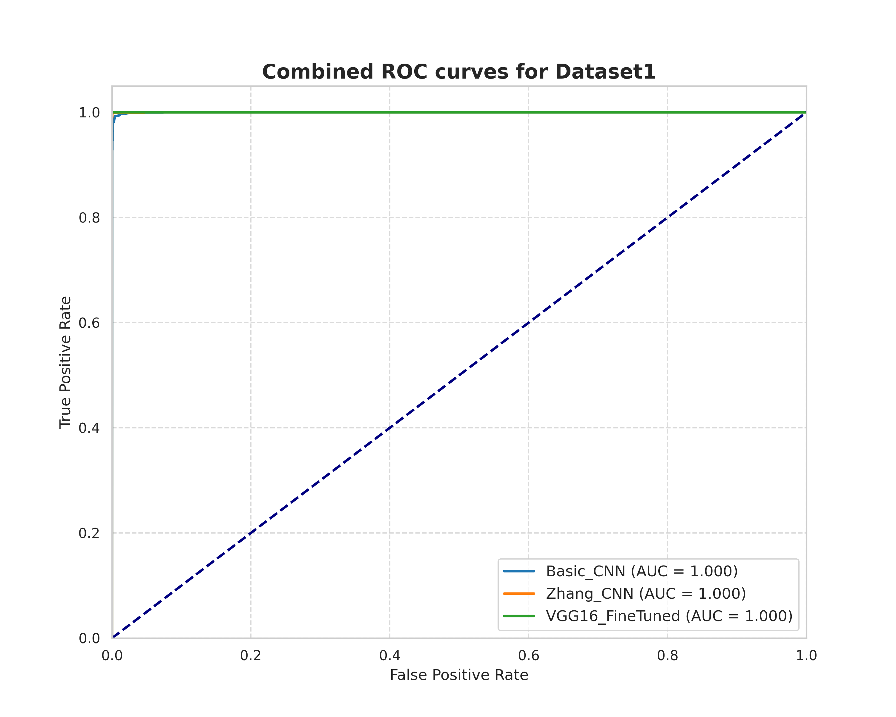

#### Dataset 1 Confusion Matrices & Training History

Click to expand charts for Dataset 1

**VGG16 Fine-Tuned**
-  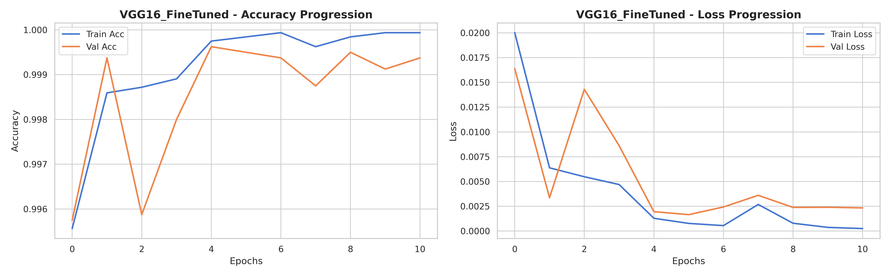

**Zhang CNN**
-  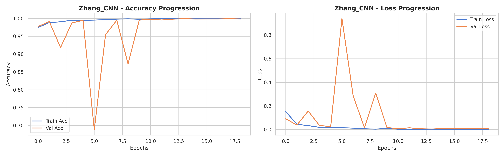

**Basic CNN**
- 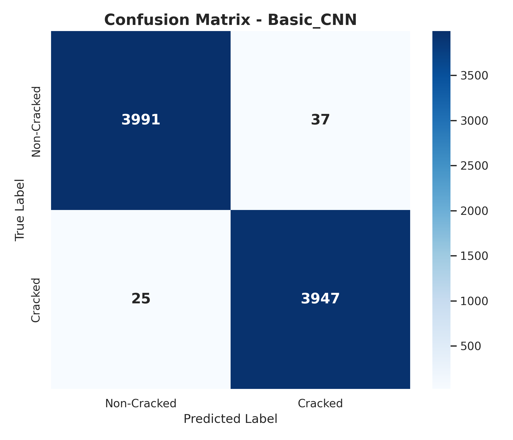 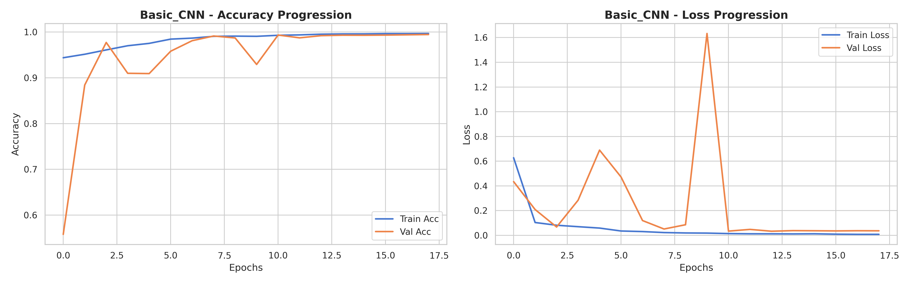

---

### Dataset 2 Evaluation
Dataset 2 represents a more challenging baseline with slightly more nuanced background environments.

| Model | Accuracy | Precision | Recall | F1-Score |
|---|---|---|---|---|
| **VGG16 Fine-Tuned** | **99.50%** | **99.90%** | **99.52%** | **99.71%** |
| **Zhang CNN** | 99.25% | **99.90%** | 99.24% | 99.57% |
| **Basic CNN** | 89.85% | 96.69% | 91.47% | 94.01% |

  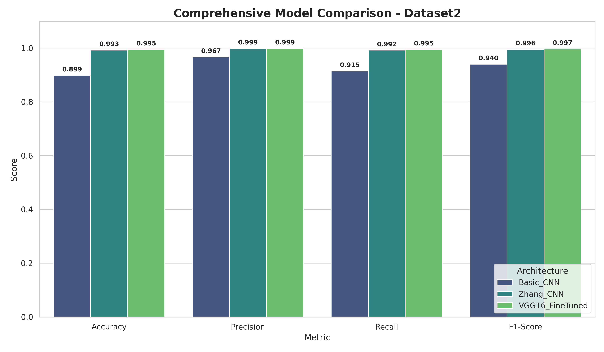
  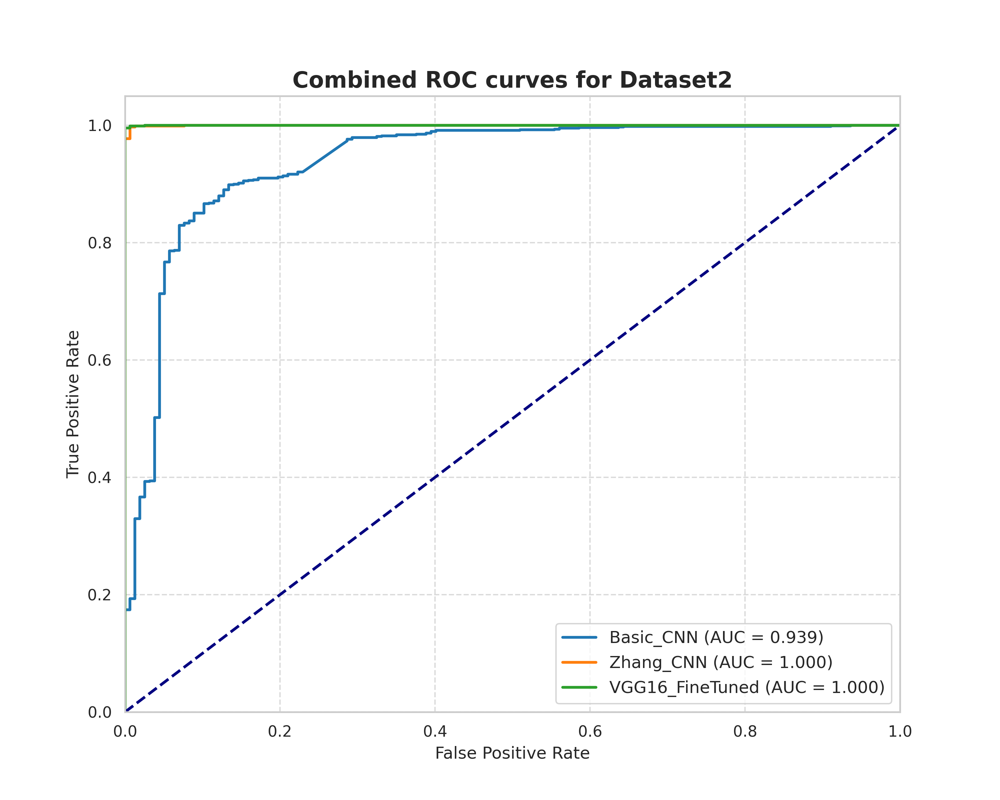

#### Dataset 2 Confusion Matrices & Training History

Click to expand charts for Dataset 2

**VGG16 Fine-Tuned**
- 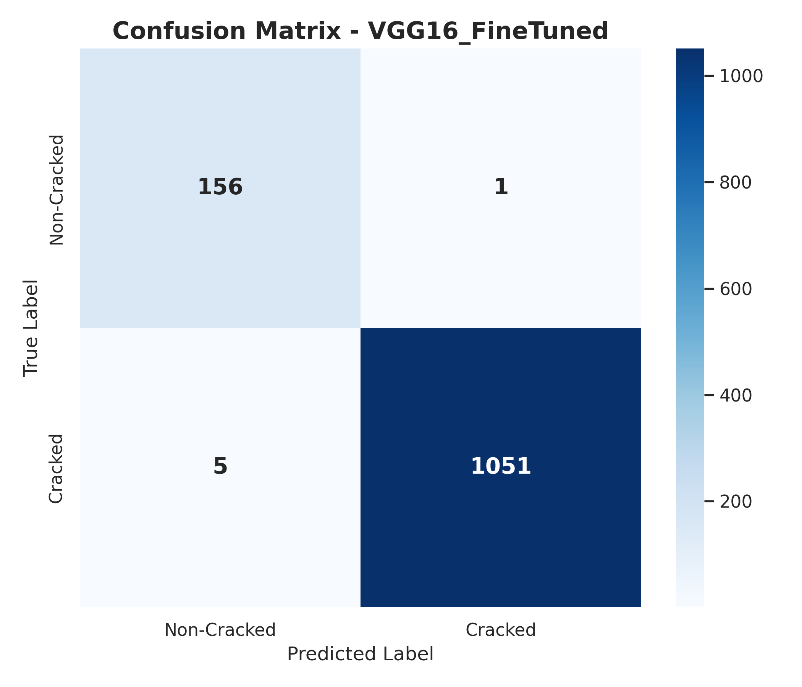 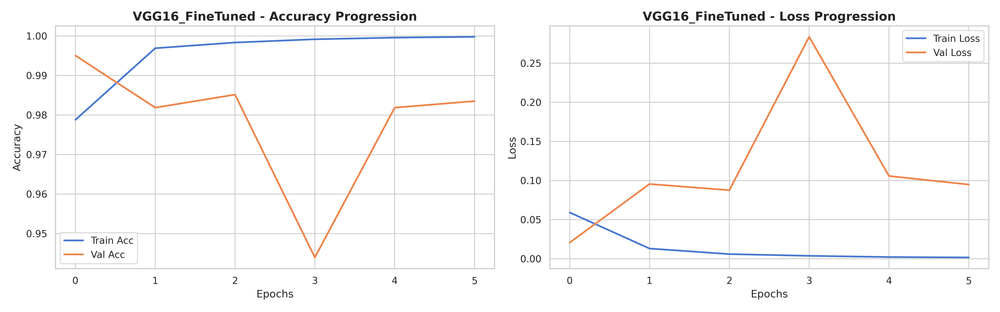

**Zhang CNN**
- 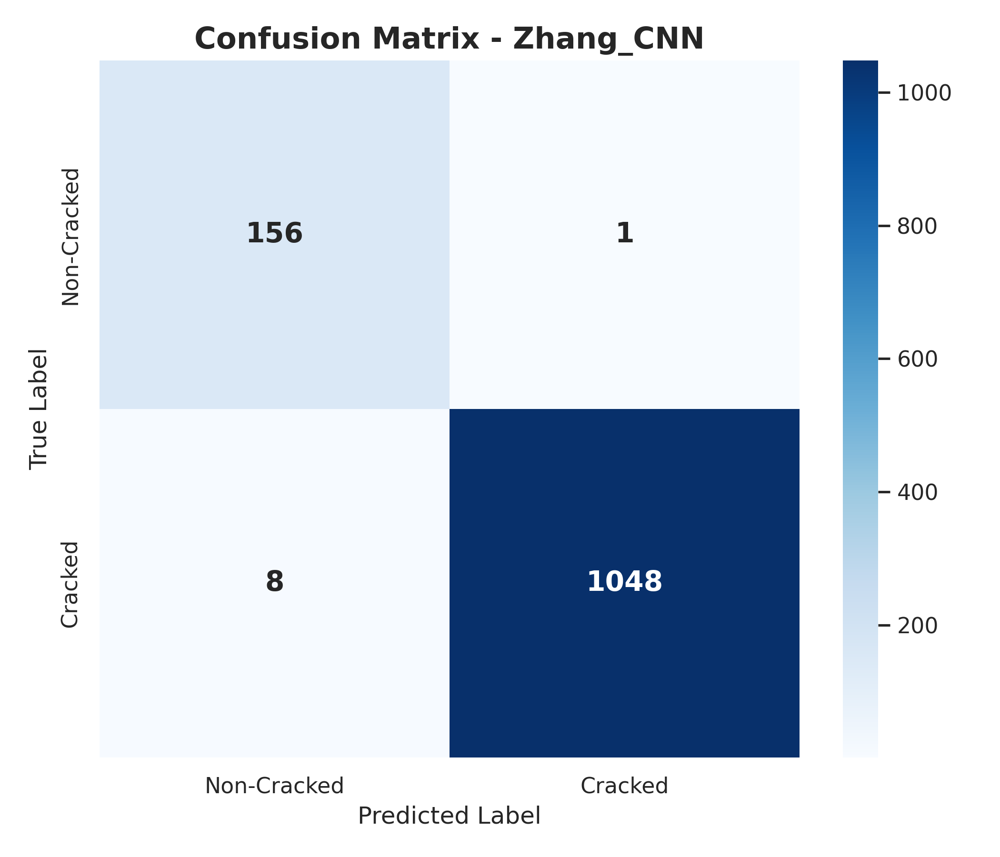 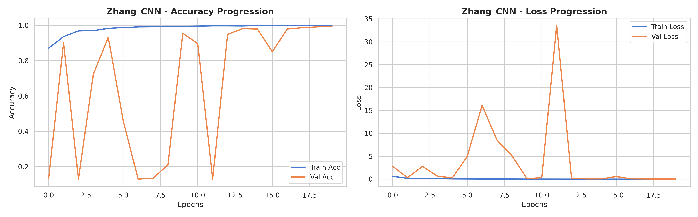

**Basic CNN**
- 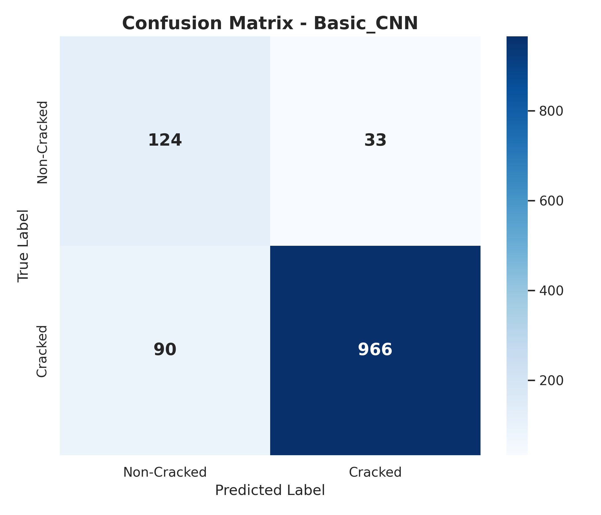 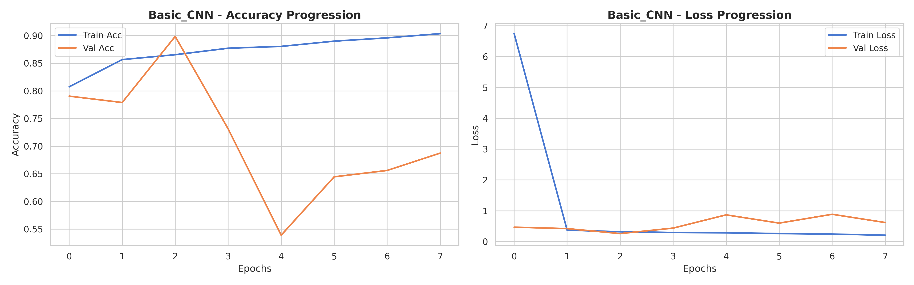

---

## 🚀 How to Run

1. Upload the `MLProject.ipynb` directory structure directly to Google Colab.
2. The project will automatically:
   - Mount your Google Drive.
   - Unzip the dataset seamlessly into the local Colab NVMe SSD storage for faster processing.
   - Run feature extraction via `tf.data` for caching and performant GPU training.
   - Perform model training (skips automatically if saved `.keras` checkpoints are found in Drive) and output the artifacts and charts directly into the `/Output/` directory within your Drive.
